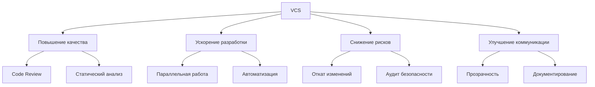
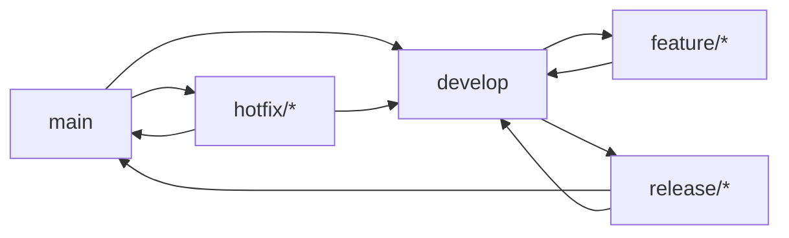

# **Методы организации работы в команде разработчиков. Системы контроля версий: цели, задачи, этапы**

## **Часть 1: Методы организации работы в команде разработчиков**

### **1.1 Традиционные методологии (Waterfall-подход)**

#### **Каскадная модель (Waterfall)**
```
Требования → Дизайн → Реализация → Тестирование → Внедрение → Поддержка
```

**Принципы:**
- Последовательное выполнение этапов
- Тщательное документирование
- Жесткое планирование

**Преимущества:**
- Четкая структура
- Предсказуемость сроков и бюджета
- Хорошая документация

**Недостатки:**
- Сложность внесения изменений
- Позднее тестирование
- Низкая гибкость

**Применение:** Критические системы (банковские, медицинские), госзаказы.

### **1.2 Гибкие методологии (Agile)**

#### **Scrum**
**Роли:**
- **Product Owner** (владелец продукта)
- **Scrum Master** (скрам-мастер)
- **Development Team** (команда разработки)

**Артефакты:**
- **Product Backlog** (бэклог продукта)
- **Sprint Backlog** (бэклог спринта)
- **Increment** (инкремент)

**Церемонии:**
```
Sprint Planning → Daily Scrum → Sprint Review → Sprint Retrospective
      (2-4 недели)     (15 мин/день)
```

**Пример спринта:**
```markdown
Sprint #12: Реализация авторизации через соцсети
Длительность: 2 недели (01.04-14.04)
Цель: Увеличить конверсию регистрации на 15%

Задачи:
- [ ] Интеграция с VK API (8ч)
- [ ] Интеграция с Google OAuth (6ч)
- [ ] Тестирование безопасности (4ч)
- [ ] Документирование (2ч)
```

#### **Kanban**
**Принципы:**
- Визуализация рабочего процесса
- Ограничение Work in Progress (WIP)
- Управление потоком

**Доска Kanban:**
```
Backlog → To Do → In Progress → Code Review → Testing → Done
    ↑                                                      ↓
    ←←←←←←←←←←←←←←←←←←←←←←←←←←←←←←←←←←←←←←←←←←←←←←←←←←←←←←
```

**WIP-лимиты:**
- In Progress: максимум 3 задачи на разработчика
- Code Review: максимум 2 задачи
- Testing: максимум 4 задачи

### **1.3 Гибридные подходы**

#### **Scrumban**
Комбинация Scrum и Kanban:
- Фиксированные спринты из Scrum
- WIP-лимиты и визуализация из Kanban
- Ежедневные стендапы
- Непрерывное планирование

#### **SAFe (Scaled Agile Framework)**
Для больших организаций:
```
Portfolio → Value Stream → Agile Release Train → Team
```

### **1.4 DevOps-подход**
**Принципы CALMS:**
- **C**ulture (Культура сотрудничества)
- **A**utomation (Автоматизация)
- **L**ean (Бережливое производство)
- **M**easurement (Измерения)
- **S**haring (Обмен знаниями)

**Практики:**
```yaml
development:
  - trunk-based development
  - feature flags
  - code review
  
operations:
  - infrastructure as code
  - monitoring & alerting
  - incident management
  
automation:
  - CI/CD pipeline
  - automated testing
  - deployment automation
```

### **1.5 Современные подходы**

#### **Shape Up (от Basecamp)**
**Циклы:**
1. **Шестинедельные циклы** разработки
2. **Двухнедельная пауза** для планирования
3. **"Фигуры"** вместо user stories

**Принципы:**
- Работа в небольших командах (2-3 человека)
- Полная автономия команд
- Ограниченный объем работ

#### **GitHub Flow**
```
1. Создать ветку
2. Добавить коммиты
3. Открыть Pull Request
4. Обсудить и доработать
5. Слить в master
6. Удалить ветку
```

## **Часть 2: Системы контроля версий (VCS)**

### **2.1 Цели систем контроля версий**

#### **Основные цели:**
1. **Хранение истории изменений**
   - Полная история всех модификаций
   - Возможность отката к любой версии
   - Аудит изменений

2. **Параллельная разработка**
   - Работа нескольких разработчиков
   - Изоляция экспериментов
   - Слияние изменений

3. **Резервное копирование**
   - Защита от потери кода
   - Географическое распределение
   - Восстановление данных

4. **Автоматизация процессов**
   - CI/CD интеграция
   - Автотесты
   - Автоматическое развертывание

#### **Бизнес-цели:**


### **2.2 Задачи систем контроля версий**

#### **Технические задачи:**
1. **Управление версиями**
   ```bash
   # Пример: Git
   git init                    # Инициализация репозитория
   git add .                   # Добавление изменений
   git commit -m "feat: add auth"  # Фиксация версии
   git tag v1.0.0              # Метка версии
   git checkout v1.0.0         # Переключение на версию
   ```

2. **Ветвление и слияние**
   ```bash
   git branch feature/login    # Создание ветки
   git checkout feature/login  # Переключение на ветку
   git merge feature/login     # Слияние ветки
   git rebase main             # Перебазирование
   ```

3. **Разрешение конфликтов**
   ```markdown
   Конфликт в файле app.js:
   
   <<<<<<< HEAD
   function auth() {
     // Новая реализация
   }
   =======
   function auth() {
     // Старая реализация
   }
   >>>>>>> feature/login
   
   Решение: выбрать нужный вариант или объединить
   ```

4. **Распределенная работа**
   ```bash
   git clone https://github.com/user/repo.git  # Клонирование
   git fetch origin                           # Получение изменений
   git pull origin main                       # Обновление локальной копии
   git push origin feature/login              # Отправка изменений
   ```

#### **Организационные задачи:**
1. **Code Review**
   - Проверка кода коллегами
   - Стандартизация стиля
   - Обучение команды

2. **Управление релизами**
   ```yaml
   # .github/release.yml
   name: Release
   on:
     push:
       tags:
         - 'v*'
   jobs:
     build:
       runs-on: ubuntu-latest
       steps:
         - name: Create Release
           uses: actions/create-release@v1
           env:
             GITHUB_TOKEN: ${{ secrets.GITHUB_TOKEN }}
   ```

3. **Документирование**
   - CHANGELOG.md
   - README.md
   - История изменений в коммитах

### **2.3 Этапы работы с системами контроля версий**

#### **Этап 1: Настройка и инициализация**
**Шаги:**
1. **Выбор VCS:**
   - Git (распределенная)
   - SVN (централизованная)
   - Mercurial (распределенная)

2. **Настройка репозитория:**
   ```bash
   # Локальная инициализация
   mkdir project
   cd project
   git init
   
   # Настройка удаленного репозитория
   git remote add origin https://github.com/user/project.git
   
   # Настройка пользователя
   git config --global user.name "John Doe"
   git config --global user.email "john@example.com"
   ```

3. **Создание структуры:**
   ```bash
   # Игнорирование файлов
   echo "node_modules/" >> .gitignore
   echo ".env" >> .gitignore
   echo "*.log" >> .gitignore
   
   # Инициализация README
   echo "# Project Name" >> README.md
   echo "## Description" >> README.md
   ```

#### **Этап 2: Ежедневная работа**
**Workflow разработчика:**
```bash
# 1. Получение актуальной версии
git pull origin main

# 2. Создание ветки для задачи
git checkout -b feature/TASK-123

# 3. Разработка и коммиты
git add .
git commit -m "feat: implement user registration"

# 4. Отправка в удаленный репозиторий
git push origin feature/TASK-123

# 5. Создание Pull Request
# (через веб-интерфейс GitHub/GitLab)

# 6. Code Review и правки
git add .
git commit --amend  # Изменение последнего коммита
git push -f origin feature/TASK-123

# 7. Слияние после approval
# (выполняет мейнтейнер)
```

#### **Этап 3: Ветвление и стратегии**
**Git Flow:**


**Команды Git Flow:**
```bash
# Инициализация
git flow init

# Новая функциональность
git flow feature start login-form

# Завершение функциональности
git flow feature finish login-form

# Создание релиза
git flow release start 1.2.0

# Завершение релиза
git flow release finish 1.2.0

# Горячее исправление
git flow hotfix start 1.2.1
```

**GitHub Flow (упрощенный):**
```bash
# Все изменения через Pull Requests
git checkout -b new-feature
# разработка...
git push origin new-feature
# создание PR, review, merge
```

#### **Этап 4: Code Review процесс**
**Правила code review:**
```markdown
## Правила для автора:
1. Размер PR: до 400 строк
2. Описание: что сделано и почему
3. Тесты: покрытие новой функциональности
4. Стиль: соответствует стандартам

## Правила для ревьюера:
1. Время ответа: до 24 часов
2. Конструктивная критика
3. Проверка:
   - Функциональность
   - Тесты
   - Безопасность
   - Производительность
```

**Шаблон Pull Request:**
```markdown
## Описание изменений
[Краткое описание того, что было сделано]

## Тип изменений
- [ ] Исправление бага (bug fix)
- [x] Новая функциональность (feature)
- [ ] Рефакторинг
- [ ] Документация

## Связанные задачи
Closes #123, Related to #456

## Чек-лист
- [ ] Код соответствует стандартам
- [ ] Написаны/обновлены тесты
- [ ] Обновлена документация
- [ ] Протестировано локально

## Скриншоты/видео
[Если применимо]
```

#### **Этап 5: Управление релизами**
**Версионирование (Semantic Versioning):**
```
MAJOR.MINOR.PATCH
1.2.3
↑ ↑ ↑
│ │ └─ Патч: обратно совместимые исправления
│ └── Минорная: обратно совместимые новые возможности
└──── Мажорная: несовместимые изменения API
```

**Процесс релиза:**
```bash
# 1. Подготовка релиза
git checkout main
git pull origin main

# 2. Создание ветки релиза
git checkout -b release/v1.2.0

# 3. Обновление версий
# package.json, pom.xml, и т.д.

# 4. Тестирование
npm test
docker-compose up --build

# 5. Создание тега
git tag -a v1.2.0 -m "Release version 1.2.0"
git push origin v1.2.0

# 6. Слияние
git checkout main
git merge release/v1.2.0
git push origin main

# 7. Удаление ветки релиза
git branch -d release/v1.2.0
```

**Автоматизация через CI/CD:**
```yaml
# .github/workflows/release.yml
name: Release
on:
  push:
    tags:
      - 'v*'
jobs:
  build:
    runs-on: ubuntu-latest
    steps:
      - name: Checkout
        uses: actions/checkout@v2
      
      - name: Build
        run: npm run build
        
      - name: Test
        run: npm test
        
      - name: Create Release
        uses: softprops/action-gh-release@v1
        with:
          generate_release_notes: true
```

#### **Этап 6: Мониторинг и обслуживание**
**Метрики репозитория:**
```bash
# Статистика репозитория
git log --oneline --graph --all
git shortlog -sn  # Количество коммитов по авторам
git diff --stat main..develop  # Разница между ветками

# Поиск проблем
git log --grep="fix"  # Поиск коммитов с исправлениями
git blame app.js  # Кто написал каждую строку
git bisect start  # Бинарный поиск бага
```

**Очистка репозитория:**
```bash
# Удаление мертвых веток
git fetch --prune

# Сжатие репозитория
git gc --aggressive

# Очистка истории
git filter-branch  # (осторожно!)
```

### **2.4 Инструменты и экосистема**

#### **Git-хосты:**
1. **GitHub**
   ```yaml
   Особенности:
     - Pull Requests
     - Actions (CI/CD)
     - Issues
     - Projects
     - Packages
   ```

2. **GitLab**
   ```yaml
   Особенности:
     - Встроенный CI/CD
     - Container Registry
     - Wiki
     - Kubernetes интеграция
   ```

3. **Bitbucket**
   ```yaml
   Особенности:
     - Интеграция с Jira
     - Pipelines
     - Smart Mirroring
   ```

#### **GUI-клиенты:**
- **GitKraken** - кроссплатформенный
- **SourceTree** - от Atlassian
- **GitHub Desktop** - простой интерфейс
- **VS Code Git Integration** - встроенный

#### **Инструменты для командной работы:**
```yaml
Code Review:
  - GitHub Pull Requests
  - GitLab Merge Requests
  - Gerrit
  - Phabricator

CI/CD:
  - Jenkins
  - GitHub Actions
  - GitLab CI/CD
  - CircleCI
  - Travis CI

Документация:
  - GitBook
  - MkDocs
  - Docusaurus
  - Read the Docs
```

### **2.5 Best Practices**

#### **Правила коммитов:**
```bash
# Conventional Commits
<type>[optional scope]: <description>

[optional body]

[optional footer]

# Типы:
# feat:      Новая функциональность
# fix:       Исправление бага
# docs:      Документация
# style:     Форматирование
# refactor:  Рефакторинг
# test:      Тесты
# chore:     Обслуживание
```

**Примеры:**
```bash
git commit -m "feat(auth): add OAuth2 support"
git commit -m "fix(api): handle null response in users endpoint"
git commit -m "docs(readme): update installation instructions"
```

#### **Правила веток:**
```bash
# Паттерны именования
feature/TASK-123-short-description
bugfix/TASK-456-fix-login
hotfix/urgent-security-fix
release/v1.2.0
```

#### **Git Hooks:**
```bash
# .git/hooks/pre-commit
#!/bin/bash
# Проверка стиля кода
npm run lint
# Запуск тестов
npm test
```

**Пример Husky (npm пакет):**
```json
{
  "husky": {
    "hooks": {
      "pre-commit": "npm run lint",
      "pre-push": "npm test",
      "commit-msg": "commitlint -E HUSKY_GIT_PARAMS"
    }
  }
}
```

## **Часть 3: Интеграция методологий и VCS**

### **3.1 Agile + Git Workflow**

**Пример процесса для Scrum-команды:**
```markdown
## Sprint Planning Day:
1. Product Owner обновляет Product Backlog
2. Команда оценивает задачи
3. Создание Sprint Backlog
4. Создание веток для задач:
   git checkout -b feature/SPRINT-12-TASK-456

## Daily Work:
1. Утренний стендап
2. Разработка в feature-ветках
3. Регулярные коммиты
4. Code review коллег

## Sprint Review:
1. Демонстрация инкремента
2. Слияние в develop ветку
3. Обсуждение результатов

## Sprint Retrospective:
1. Анализ метрик Git
2. Обсуждение проблем процесса
3. Планирование улучшений
```

### **3.2 DevOps + GitOps**

**GitOps принципы:**
1. **Infrastructure as Code** в Git
2. **Pull Request** для всех изменений
3. **Автоматическое развертывание** при слиянии
4. **Неизменяемая инфраструктура**

**Пример репозитория:**
```
infrastructure-repo/
├── kubernetes/
│   ├── deployments/
│   ├── services/
│   └── configmaps/
├── terraform/
│   ├── main.tf
│   └── variables.tf
├── ansible/
│   └── playbooks/
├── .github/
│   └── workflows/
└── README.md
```

### **3.3 Метрики и аналитика**

#### **Метрики эффективности команды:**
```sql
-- Пример запроса для анализа
SELECT 
  author,
  COUNT(*) as commits,
  AVG(lines_changed) as avg_lines,
  MIN(commit_date) as first_commit,
  MAX(commit_date) as last_commit
FROM git_commits
WHERE commit_date > DATE_SUB(NOW(), INTERVAL 30 DAY)
GROUP BY author
ORDER BY commits DESC;
```

#### **Инструменты аналитики:**
- **GitHub Insights**
- **GitLab Analytics**
- **Bitbucket Reports**
- **Custom dashboards** (Grafana + Git API)

## **Часть 4: Практические рекомендации**

### **4.1 Для начинающих команд**

**Стартовый набор:**
```bash
# 1. Выбрать Git-хост (GitHub/GitLab)
# 2. Настроить репозиторий
# 3. Определить workflow (GitHub Flow)
# 4. Настроить CI/CD
# 5. Внедрить code review
# 6. Использовать issue tracker
```

### **4.2 Для опытных команд**

**Оптимизация процесса:**
1. **Автоматизация:**
   - Автотесты
   - Линтинг
   - Сборка и деплой

2. **Качество кода:**
   - Статический анализ
   - Security scanning
   - Performance testing

3. **Документация:**
   - Автогенерация документации
   - Живые примеры
   - API документация

### **4.3 Распространенные ошибки и решения**

| Ошибка | Решение |
|--------|---------|
| Большие коммиты | Разбивать на логические части |
| Неинформативные сообщения | Использовать Conventional Commits |
| Долгоживущие ветки | Регулярно обновлять от main |
| Конфликты при слиянии | Частые слияния, rebase |
| Потеря изменений | Частые коммиты и push |

### **4.4 Чек-лист для команды**

```markdown
## Еженедельный чек-лист:
- [ ] Все ветки обновлены от main
- [ ] Pull Requests имеют ревьюверов
- [ ] Тесты проходят успешно
- [ ] Документация обновлена
- [ ] CI/CD пайплайн работает

## Ежемесячный чек-лист:
- [ ] Анализ метрик эффективности
- [ ] Очистка старых веток
- [ ] Обновление зависимостей
- [ ] Ретроспектива процесса
- [ ] Планирование улучшений
```

## **Заключение**

**Ключевые выводы:**

1. **Выбор методологии** зависит от проекта, команды и требований
2. **Система контроля версий** - основа современной разработки
3. **Интеграция процессов** (Agile + VCS + CI/CD) дает синергетический эффект
4. **Непрерывное улучшение** процессов так же важно, как и улучшение кода
5. **Автоматизация** рутинных задач повышает эффективность

**Формула успеха:**
```
Успешная разработка = 
  (Правильные процессы × Эффективные инструменты) + 
  (Квалификация команды × Коммуникация)
```

**Дополнительные ресурсы:**
1. **Книги:** "Git Pro", "Scrum Guide", "The Phoenix Project"
2. **Курсы:** GitHub Learning Lab, GitLab University
3. **Сообщества:** DevOps RU, Moscow Python, Frontend Community
4. **Инструменты:** GitKraken, Sourcetree, VS Code GitLens
